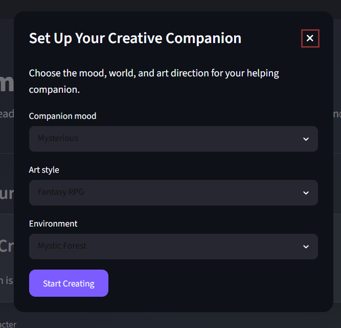
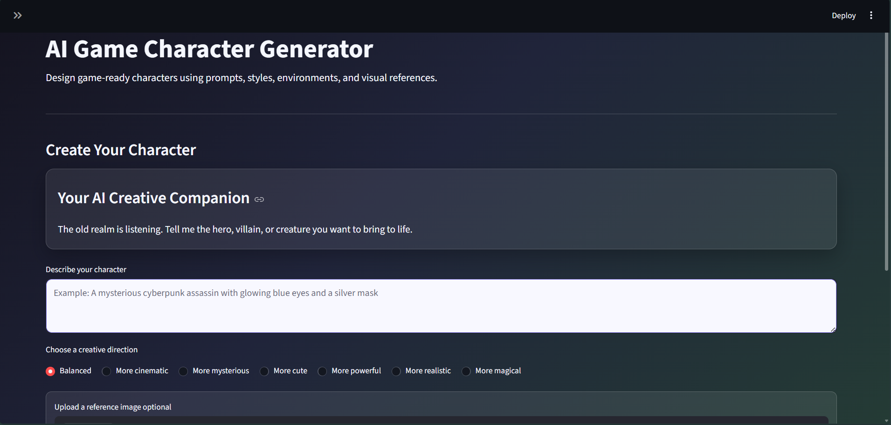
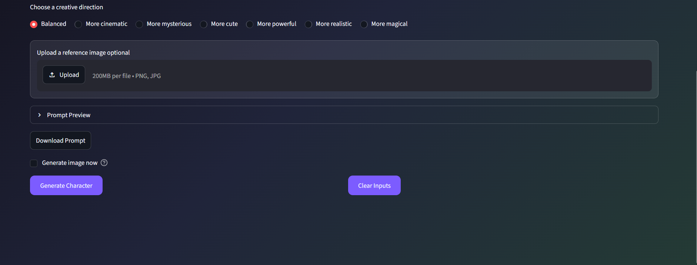
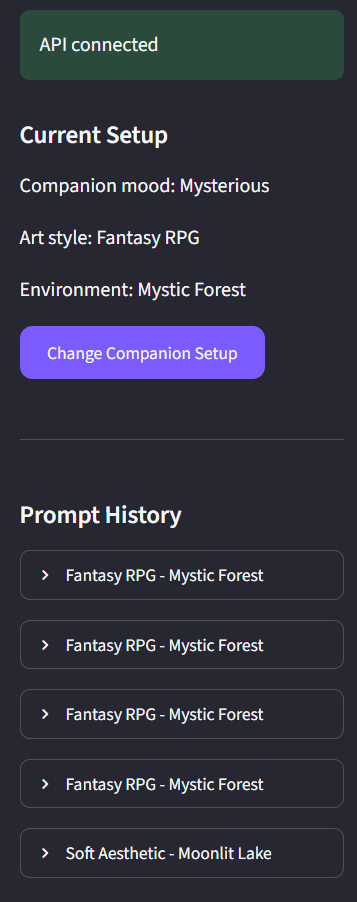

# AI Game Character Generator

AI Game Character Generator is an interactive character concept creation app for game ideas. It lets users set up a creative companion, describe a character, choose an art style and environment, optionally upload a reference image, and generate an AI-ready character prompt through a custom FastAPI backend.

## Features

- Creative companion setup popup
- Companion mood, art style, and environment selection
- Dynamic companion message based on selected art style
- Free-form character prompt input
- Optional reference image upload
- Free-form reference guidance
- Prompt preview
- Prompt download
- Custom FastAPI backend
- Prompt generation API
- Prompt history save/read/clear API
- Reference image upload API
- Optional image generation endpoint
- Image generation skip mode for saving credits
- Sidebar API health status
- Sidebar prompt history

## Tech Stack

- Python
- Streamlit
- FastAPI
- Pandas
- Pillow
- Requests
- OpenAI API
- python-dotenv

## Architecture

```text
User
 ↓
Streamlit Frontend
 ↓
FastAPI Backend
 ↓
Prompt Builder
 ↓
History Storage + Reference Image Storage
 ↓
Optional OpenAI Image Generation

## Project Structure

```text
ai_game_character_generator/
├── app.py
├── backend/
│   └── main.py
├── data/
│   └── history.csv
├── outputs/
│   ├── generated_images/
│   └── reference_images/
├── requirements.txt
├── .env
└── README.md

## Project Summary

Built an AI-assisted game character creation platform using Streamlit and a custom FastAPI backend. The system supports companion-based setup, reference-guided prompt creation, prompt history management, reference image upload, optional OpenAI image generation, and safe image-generation skipping for development.

The backend exposes custom API endpoints for prompt generation, history persistence, history retrieval, history clearing, reference image upload, and image generation orchestration.

## Screenshots

### Companion Setup


### Main Generator Top


### Main Generator Bottom


### API Status And History
