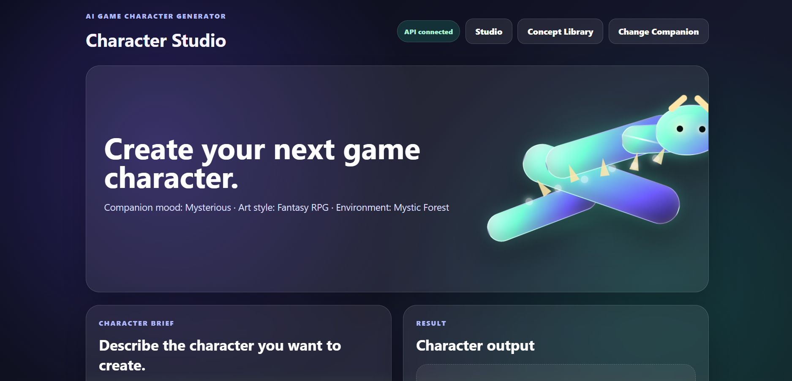

# AI Game Character Generator

AI Game Character Generator is an interactive character concept creation app for game ideas. It lets users set up a creative companion, describe a character, choose an art style and environment, optionally upload a reference image, and generate an AI-ready character prompt through a custom FastAPI backend.

## Features

- Creative companion setup popup
- Companion mood, art style, and environment selection
- Dynamic companion message based on selected art style
- Free-form character prompt input
- Optional reference image upload
- Free-form reference guidance
- Prompt preview
- Prompt download
- Custom FastAPI backend
- Prompt generation API
- Prompt history save/read/clear API
- Reference image upload API
- Optional image generation endpoint
- Image generation skip mode for saving credits
- Sidebar API health status
- Sidebar prompt history
- SQLite-backed prompt history
- Individual history item deletion
- Recent Concepts gallery section
- Modular backend structure with separate database, prompt, and image services
- React-based character studio
- Animated dragon companion setup experience
- Style-adaptive dragon companion colors
- Concept library with search, filter, delete, and clear actions
- API status indicator in the React frontend
- Reference image preview

## Tech Stack

- Python
- SQLite
- Streamlit
- FastAPI
- Pandas
- Pillow
- Requests
- OpenAI APIs
- python-dotenv
- React
- Vite
- Framer Motion
- Lucide React

## Frontend

The main frontend is built with React and Vite. It includes a dragon companion setup experience, character studio, reference image preview, API status indicator, and concept library.

Run the React frontend:

```bash
cd frontend
npm install
npm run dev
```

React runs at:

```text
http://localhost:5173
```

The older Streamlit prototype is still kept as `app.py`.

## Architecture

```text
User
 ↓
Streamlit Frontend
 ↓
FastAPI Backend
 ↓
Prompt Builder
 ↓
SQLite History Database + Reference Image Storage
 ↓
Optional OpenAI Image Generation
```

## Project Structure

```text
ai_game_character_generator/
├── app.py
├── backend/
|    ├── main.py
|    ├── database.py
|    ├── prompt_service.py
|    └── image_service.py
├── data/
│   └── app.db
├── outputs/
│   ├── generated_images/
│   └── reference_images/
├── requirements.txt
├── .env
└── README.md
```

## Project Summary

Built an AI-assisted game character creation platform using Streamlit and a custom FastAPI backend. The system supports companion-based setup, reference-guided prompt creation, prompt history management, reference image upload, optional OpenAI image generation, and safe image-generation skipping for development.

The backend exposes custom API endpoints for prompt generation, history persistence, history retrieval, history clearing, reference image upload, and image generation orchestration.

## Screenshots

### Companion Setup


### Main Generator Top


### Main Generator Bottom


### API Status And History


### Dragon Companion Setup


### Character Studio


### Concept Library


## Environment Variables

This project uses an OpenAI API key for optional image generation.

Create a `.env` file in the main project folder and add:

```text
OPENAI_API_KEY=your_openai_api_key_here
```

Do not upload your real `.env` file to GitHub.

## Notes

Image generation is implemented as an optional backend endpoint. During development, the app includes a "Generate image now" checkbox so prompt generation and history workflows can be tested without spending image-generation credits.

If OpenAI billing or credits are unavailable, the app still supports prompt generation, reference upload, history tracking, and prompt download.